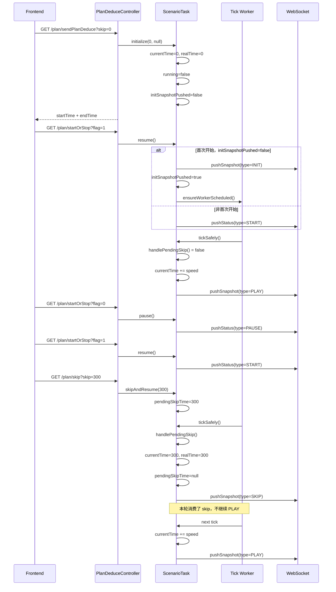

# ScenarioTask `initSnapshotPushed` / `pendingSkipTime` 设计说明

## 1. 目的

本文说明 `ScenarioTask` 中两个运行时控制变量的设计意图：

- `initSnapshotPushed`
- `pendingSkipTime`

重点回答下面两个问题：

- 这两个变量分别是做什么的
- 为什么它们是必要的，分别适用于什么场景

对应代码位置：

- `initSnapshotPushed` 定义在 [src/main/java/com/example/plandeduce/service/ScenarioTask.java](../src/main/java/com/example/plandeduce/service/ScenarioTask.java)
- `pendingSkipTime` 定义在 [src/main/java/com/example/plandeduce/service/ScenarioTask.java](../src/main/java/com/example/plandeduce/service/ScenarioTask.java)

## 2. 结论

这两个变量都不是业务结果数据，而是播放控制过程中的运行时状态。

- `initSnapshotPushed`：控制“这一轮播放是否已经向前端发送过首次初始化快照”
- `pendingSkipTime`：控制“用户请求的跳转时间先登记下来，再交给播放线程串行消费”

一句话总结：

- `initSnapshotPushed` 解决的是“首次开始”和“暂停后继续”要不要重复发初始化快照的问题
- `pendingSkipTime` 解决的是“跳转命令”和“正常播放推进”如何避免并发冲突的问题

## 3. `initSnapshotPushed` 是做什么的

### 3.1 变量含义

`initSnapshotPushed` 表示：

- 当前这轮播放是否已经发过一次 `INIT` 类型的完整快照

它的典型逻辑在 `resume()` 中：

- 如果还没发过 `INIT`，先推一次当前时刻完整快照
- 然后把它标记为 `true`
- 后续再恢复播放时，不重复发 `INIT`，只发 `START`

也就是说，这个变量不是“任务有没有初始化”，而是：

- “前端这轮播放有没有拿到起播基准快照”

### 3.2 为什么需要它

如果没有这个变量，会出现两个典型问题。

#### 问题一：暂停后恢复会重复发送初始化快照

第一次开始播放时，前端确实需要一份完整快照作为基准状态。

但如果用户只是：

1. 点击开始
2. 点击暂停
3. 再点击继续

这时前端已经有了当前状态，不应该再收到一次 `INIT` 全量快照，否则：

- 推送数据会重复
- “继续播放”和“重新初始化”语义会混淆
- 前端可能需要额外区分这是不是一次真正的重新开始

#### 问题二：播放结束后无法正确重播

代码里在播放结束后再次开始时，会调用 `resetForReplay()`，把：

- `currentTime` 重置为 `0`
- `realTime` 重置为 `0`
- `initSnapshotPushed` 重置为 `false`

这样下一次点击开始，系统才会重新发送一次 `INIT`，表示：

- 现在不是“从暂停处继续”
- 而是“从头重新播放”

如果没有 `initSnapshotPushed`，就很难把“恢复播放”和“重播”这两种动作区分干净。

### 3.3 它的应用场景

`initSnapshotPushed` 主要用于下面这些场景：

- 初始化后第一次点击开始
- 暂停后继续播放
- 播放结束后再次点击开始，从头重播
- 先修改倍速、后点击开始这类延迟启动场景

### 3.4 对应时序语义

用前端能感知到的行为来描述：

- 第一次开始：发 `INIT`
- 暂停后恢复：发 `START`
- 播放中持续推进：发 `PLAY`
- 播放结束后重播：重新发 `INIT`

所以 `initSnapshotPushed` 的本质作用是：

- 保证 `INIT` 只在“真正需要重新建立基准状态”时发送

## 4. `pendingSkipTime` 是做什么的

### 4.1 变量含义

`pendingSkipTime` 表示：

- 当前是否存在一个尚未被播放线程处理的跳转请求

当用户调用 `/plan/skip` 时，后端并不会直接在接口线程里完成跳转，而是：

1. 先把目标时间写进 `pendingSkipTime`
2. 等播放线程下一次执行 `tickSafely()` 时优先消费它
3. 由播放线程统一更新 `currentTime` / `realTime`
4. 推送一条 `SKIP` 类型完整快照

### 4.2 为什么需要它

如果没有这个变量，而是在 HTTP 线程里直接改时间、查快照、推送消息，会出现几个问题。

#### 问题一：跳转与播放推进可能并发冲突

播放线程会周期性执行 `tickSafely()`，推进时间并推送 `PLAY`。

如果用户在这个时候又发起了 `skip`，那么就会形成两条执行链同时操作：

- 一条在做正常播放推进
- 一条在做强制跳点

容易出现：

- `currentTime` 被交错修改
- 前端先收到旧时间的 `PLAY`
- 又收到新时间的 `SKIP`
- 消息顺序和状态表现不稳定

`pendingSkipTime` 的作用就是把跳转请求收敛成：

- “不要立刻执行，等 worker 线程串行处理”

#### 问题二：跳转后的快照可能和播放状态不一致

跳转不是简单改一下 `currentTime`，还需要：

- 更新 `realTime`
- 查询对应的全量快照
- 查询对应的增量快照
- 一次性推送一条 `SKIP` 消息给前端

这些动作本身就应该和正常播放推送共用同一条串行发送链路，否则很容易出现：

- 时间已经改到目标秒
- 但上一帧的播放消息才刚发出去

这会让前端很难稳定还原状态。

#### 问题三：用户希望“停在目标秒点”，而不是跳完立刻又走一帧

当前实现里，`tickSafely()` 会先调用 `handlePendingSkip()`。

只要本轮消费了一个跳点，就会：

- 立即推送 `SKIP`
- 本轮不再继续推进播放时间

这样用户拖到某个时间点后，前端就能先稳定停在目标秒观察结果。

如果没有 `pendingSkipTime` 这种“待消费命令”机制，跳过去后同一轮又继续 `PLAY` 的风险会更高。

### 4.3 它的应用场景

`pendingSkipTime` 主要用于下面这些场景：

- 用户拖动进度条跳到任意秒点
- 正在播放时突然跳到另一个时间
- 暂停状态下先跳转，再继续播放
- 前端需要立即看到某个时间点对应的完整快照，而不是等待自然播放推进到那里

### 4.4 本质作用

`pendingSkipTime` 的本质不是“存一个时间值”，而是：

- 把 `skip` 变成一种由播放线程异步串行消费的控制命令

这样做的收益是：

- 避免并发修改时间状态
- 保证消息顺序稳定
- 保证 `SKIP` 和 `PLAY` 走同一条推送时序

## 5. 两个变量分别解决什么问题

可以把它们分成两个层面理解。

### 5.1 `initSnapshotPushed` 解决的是“首次状态建立”

它关心的是：

- 前端是否已经拿到本轮播放的起始基准快照

所以它解决的是：

- `INIT` 该发几次
- 什么时候该发 `INIT`
- 什么时候只需要 `START`

### 5.2 `pendingSkipTime` 解决的是“控制命令串行化”

它关心的是：

- 跳转命令应当由谁执行
- 什么时候执行
- 如何避免和正常播放推进打架

所以它解决的是：

- `skip` 和 `play` 的执行顺序
- 跳转后的快照一致性
- WebSocket 推送顺序稳定性

## 6. 典型场景说明

下面用一个完整场景串起来说明这两个变量怎么配合：

1. 前端调用初始化接口 `/plan/sendPlanDeduce?skip=0`
2. 后端创建或复用 `ScenarioTask`
3. `initialize()` 执行后：
   - `currentTime = 0`
   - `realTime = 0`
   - `running = false`
   - `initSnapshotPushed = false`
4. 用户点击开始 `/plan/startOrStop?flag=1`
5. `resume()` 发现 `initSnapshotPushed = false`
6. 后端先推送一次 `INIT` 完整快照
7. 然后把 `initSnapshotPushed` 设为 `true`
8. 后续 worker 开始按 tick 推送 `PLAY`
9. 用户点击暂停
10. 后端只发 `PAUSE`，不会改 `initSnapshotPushed`
11. 用户再次点击开始
12. `resume()` 发现 `initSnapshotPushed = true`
13. 这次不发 `INIT`，只发 `START`
14. 用户拖动进度条到 `300`
15. `/plan/skip` 只把 `pendingSkipTime = 300`
16. 下一个 tick 到来时，worker 先消费 `pendingSkipTime`
17. 后端更新 `currentTime = 300`、`realTime = 300`
18. 后端推送 `SKIP` 完整快照
19. 本轮不继续 `PLAY`
20. 下一轮 tick 再从 `300` 之后继续推进

这个场景里：

- `initSnapshotPushed` 保证第一次开始和暂停后恢复的语义不同
- `pendingSkipTime` 保证拖动跳转不会和播放线程并发冲突

## 7. 时序图

下面是“初始化 -> 开始 -> 暂停 -> 恢复 -> 跳转 -> 继续播放”的典型时序图。

## 8. 最终总结

`initSnapshotPushed` 和 `pendingSkipTime` 虽然都只是一个很小的状态变量，但它们分别守住了两件关键事情：

- `initSnapshotPushed` 守住“初始化快照什么时候发”的边界
- `pendingSkipTime` 守住“跳转命令由谁执行、按什么顺序执行”的边界

如果少了它们，系统不一定马上报错，但在下面这些真实交互中会很容易出现语义混乱或时序问题：

- 暂停后恢复
- 结束后重播
- 播放中拖动进度条跳转
- 跳转和播放同时发生

因此这两个变量的价值，不在于保存业务数据，而在于保证：

- 播放控制语义清晰
- WebSocket 推送顺序稳定
- 前端能可靠地还原当前时刻状态
