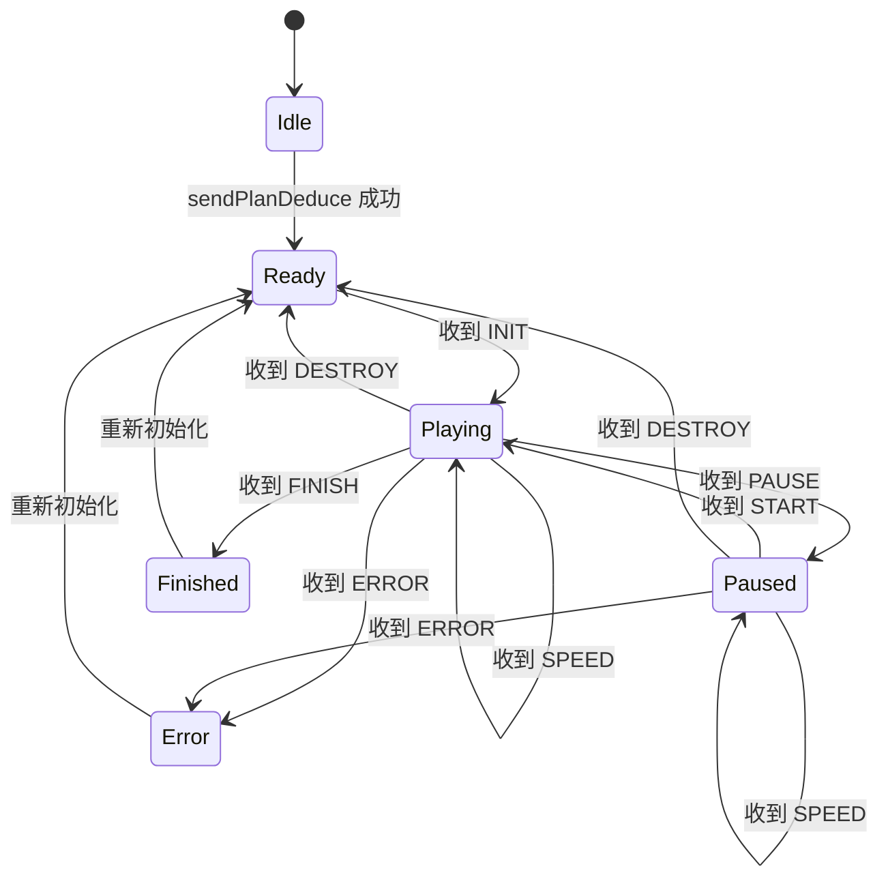
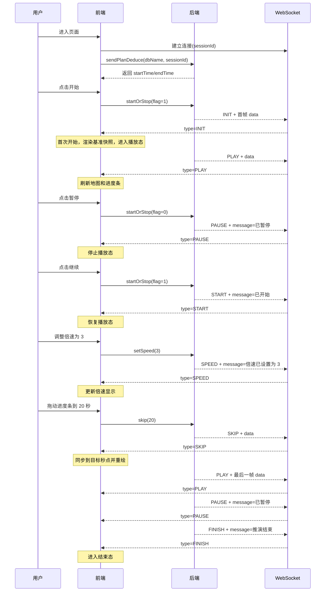

# ScenarioTask `pushStatus` 中 `type` / `text` 字段设计说明

## 1. 目的

本文说明 `ScenarioTask.pushStatus(String type, Integer fullTime, String text)` 中：

- 为什么同时需要 `type`
- 为什么同时需要 `text`
- 前后端各自依赖这两个字段解决什么问题
- 在进度条播放业务里它们如何协作
- 当前所有 `type` 枚举值是什么

当前代码中：

- `type` 会进入 WebSocket 消息的 `type` 字段
- `text` 会进入 WebSocket 消息的 `message` 字段

也就是说，`pushStatus(type, text)` 最终对应的是：

```json
{
  "type": "PAUSE",
  "message": "已暂停"
}
```

## 2. 结论

这两个字段解决的是两类不同问题：

- `type`：机器可读，给前端程序判断和分支处理用
- `text`：人类可读，给页面提示、联调日志、排障说明用

一句话总结：

- `type` 用来驱动程序行为
- `text` 用来解释这次行为发生了什么

## 3. 为什么不能只保留一个字段

### 3.1 如果只有 `text`

如果只发：

```json
{
  "message": "已暂停"
}
```

前端会有几个问题：

- 需要靠中文文案判断状态，协议不稳定
- 后端文案一旦改成“暂停中”或“当前已暂停”，前端逻辑就可能失效
- 多语言场景无法复用
- 文案适合展示，不适合做结构化分支

也就是说，前端不能写这种逻辑：

```js
if (msg.message === '已暂停') {
  stopProgress()
}
```

这是脆弱协议。

### 3.2 如果只有 `type`

如果只发：

```json
{
  "type": "PAUSE"
}
```

虽然程序能跑，但也会有问题：

- 页面提示文案需要前端自己维护一份映射
- 多个前端会重复写“已开始/已暂停/推演结束/倍速已设置为 3”
- 联调时消息可读性差
- 排障时不直观，不利于日志观察

所以只保留 `type` 也不够。

## 4. 前后端为什么都需要这两个字段

### 4.1 后端为什么需要 `type`

后端需要一个稳定的结构化事件名，来表达“这次推送属于哪种业务动作”。

例如：

- 第一次开始播放，不是普通恢复，而是 `INIT`
- 暂停后恢复播放，是 `START`
- 正常推进中的每一帧，是 `PLAY`
- 用户拖动进度条跳转，是 `SKIP`
- 播放结束，是 `FINISH`

这些都是业务事件，不应该混在自由文案里表达。

### 4.2 前端为什么需要 `type`

前端需要依据 `type` 做确定性的状态切换。

例如：

- 收到 `INIT`：初始化基准快照，进度条进入播放态
- 收到 `PLAY`：刷新地图和进度条位置
- 收到 `PAUSE`：停止播放态，按钮改成“继续”
- 收到 `START`：从暂停态恢复
- 收到 `FINISH`：标记进度完成，按钮禁用或切到结束态
- 收到 `ERROR`：显示错误态

这些都是程序行为，只能依赖稳定枚举，不能依赖自然语言。

### 4.3 后端为什么需要 `text`

后端知道当前最准确的业务语义，因此更适合统一生成提示文案，例如：

- `已开始`
- `已暂停`
- `推演结束`
- `任务已销毁`
- `倍速已设置为 3`

这样前端不需要复制这些业务文案。

### 4.4 前端为什么需要 `text`

前端可以直接把 `text` 用在：

- toast 提示
- 状态栏说明
- 调试日志
- 联调面板

因此前端通常是：

- 用 `type` 做逻辑判断
- 用 `text` 做展示和日志

## 5. 结合进度条业务的具体场景说明

假设存在一个典型业务流程：

1. 用户进入页面
2. 建立 WebSocket
3. 调用初始化接口获取开始时间、结束时间
4. 用户点击开始
5. 系统持续播放
6. 用户点击暂停
7. 用户点击继续
8. 用户拖动进度条跳到某个时间点
9. 用户修改倍速
10. 播放到终点

在这个过程中，`type` 和 `text` 的分工如下。

### 5.1 第一次点击开始

后端先推：

```json
{
  "type": "INIT",
  "message": "当前真实时间 0 秒，推演时间 0 秒，返回第 0 秒增量数据"
}
```

前端应该：

- 根据 `type=INIT` 知道这是首次开始，不是暂停后恢复
- 使用 `data` 渲染第一帧基准数据
- 把按钮状态切成播放中

此时 `message` 只是帮助人看懂“这次初始化返回了当前秒的数据”。

### 5.2 正常播放推进

后端持续推：

```json
{
  "type": "PLAY",
  "message": "当前真实时间 3 秒，推演时间 5 秒，返回第 3-5 秒增量数据"
}
```

前端应该：

- 根据 `type=PLAY` 刷新地图和进度条
- 根据 `deduceTime` 更新当前秒点
- 根据 `running=true` 保持播放态

而 `message` 主要用于联调观察：这次到底返回的是哪个时间段的数据。

### 5.3 点击暂停

后端推：

```json
{
  "type": "PAUSE",
  "message": "已暂停"
}
```

前端应该：

- 根据 `type=PAUSE` 把进度条停住
- 把按钮文案改成“继续”
- 停掉页面内部的播放中标识

页面上可以直接把 `message` 展示成提示语。

### 5.4 暂停后继续

后端推：

```json
{
  "type": "START",
  "message": "已开始"
}
```

这里 `START` 和 `INIT` 的区别很关键：

- `INIT` 表示第一次开始，需要先给一帧基准快照
- `START` 表示从暂停态恢复，不代表首次初始化

这就是为什么不能只靠“已开始”这种文字说明来判断。

### 5.5 用户拖动进度条

后端推：

```json
{
  "type": "SKIP",
  "message": "当前真实时间 20 秒，推演时间 20 秒，返回第 20 秒全量数据"
}
```

前端应该：

- 根据 `type=SKIP` 知道这是跳点，不是正常播放帧
- 立即把进度条位置同步到目标秒点
- 用返回的 `data` 重建目标时刻状态

### 5.6 用户修改倍速

后端推：

```json
{
  "type": "SPEED",
  "message": "倍速已设置为 3"
}
```

前端应该：

- 根据 `type=SPEED` 更新当前倍速显示
- 不要把它当成播放帧
- 也不要把它当成结束态

这里 `message` 很适合直接展示给用户。

### 5.7 播放结束

后端推：

```json
{
  "type": "FINISH",
  "message": "推演结束"
}
```

前端应该：

- 根据 `type=FINISH` 标记任务结束
- 停止后续播放逻辑
- 把 UI 切到完成态

`message` 则用于直接显示“推演结束”。

## 6. 当前 `type` 的全部枚举值

当前共有 10 个：

- `INIT`
- `PLAY`
- `SKIP`
- `INTERVAL`
- `PAUSE`
- `START`
- `SPEED`
- `FINISH`
- `DESTROY`
- `ERROR`

### 6.1 快照类消息

这类消息通常带 `data`，用于刷新地图、棋子、事件和进度位置：

- `INIT`：首次开始时推送的基准快照
- `PLAY`：正常播放推进中的快照
- `SKIP`：跳转到指定秒点后的快照
- `INTERVAL`：修改全量快照间隔后，返回当前秒点对应快照

### 6.2 状态类消息

这类消息通常不带快照数据，主要用于切换状态：

- `PAUSE`：暂停
- `START`：暂停后恢复
- `SPEED`：倍速变化
- `FINISH`：播放结束
- `DESTROY`：任务销毁
- `ERROR`：执行异常

## 7. `text` 是否有枚举值

没有。

`text` 不是枚举字段，而是自由文案字段。当前状态消息里常见的文案包括：

- `已暂停`
- `已开始`
- `推演结束`
- `任务已销毁`
- `倍速已设置为 X`
- 异常时直接使用异常消息

同时，快照消息中的 `message` 也是按模板动态拼出来的，例如：

- `当前真实时间 0 秒，推演时间 0 秒，返回第 0 秒增量数据`
- `当前真实时间 3 秒，推演时间 5 秒，返回第 3-5 秒增量数据`

因此：

- `type` 是固定协议
- `text/message` 是说明性文案

前端不应依赖 `message` 做结构化判断。

## 8. 前端处理建议

推荐前端只把 `type` 作为状态流转依据：

```js
switch (msg.type) {
  case 'INIT':
    state.initialized = true
    state.running = true
    renderSnapshot(msg.data)
    break
  case 'PLAY':
    state.running = true
    state.currentTime = msg.deduceTime
    renderSnapshot(msg.data)
    break
  case 'PAUSE':
    state.running = false
    break
  case 'START':
    state.running = true
    break
  case 'SPEED':
    state.speed = msg.speed
    break
  case 'FINISH':
    state.running = false
    state.finished = true
    break
  case 'ERROR':
    state.running = false
    state.errorMessage = msg.message
    break
}
```

推荐页面展示层这样使用：

- `type`：只做逻辑判断
- `message`：只做 toast、日志、说明栏展示

## 9. 前端状态机

下面给出一个适合当前协议的简化前端状态机。



状态含义：

- `Idle`：页面刚进入，尚未初始化
- `Ready`：已拿到进度条范围，但尚未真正开始播放
- `Playing`：播放中
- `Paused`：已暂停
- `Finished`：播放结束
- `Error`：播放异常

## 10. 前端时序图

下面给出一个典型时序：初始化 -> 开始 -> 播放 -> 暂停 -> 继续 -> 调速 -> 跳点 -> 结束。



## 11. 最终设计原则

这套协议设计的核心原则是：

- 用 `type` 保证协议稳定和状态可编程
- 用 `text/message` 保证消息可读和联调友好
- 前端对状态的判断只依赖 `type`
- 前端对用户提示和日志展示使用 `message`

因此，`type` 和 `text` 不是重复字段，而是职责明确、互相配合的两个字段。
